

<h1> Project 2 Report </h1>
<h3>Name: Asif Mahmud</h3>
<h3>ID: 1511190642</h3>
<h3>Course: CSE434</h3>
<h3>Faculty Member: SAS3</h3>

 

    

___
___
___

# Automated UI Testing

## Introduction
This main purpose of this project was automated website ui testing. The ui of the website which was tested in this project was [PHPTRAVELS](https://www.phptravels.net/). The project was done by Selenimum Webdriver and the testing part was done by TestNG. Each features of the website was tested in case of ui testing.

## Tools Used
* Java 8
* Eclipse
* Selenium Webdriver
* TestNG

## Testing
Each features and their corresponding ui element of the website [PHPTRAVELS](https://www.phptravels.net/) was tested in this project. The testing was done by using Selenium Webdriver and TestNG. A more detail list of the particular test of the website is given below, for each test there was a failure test for invalid inputs and a success test for all valid inputs.

* Login Test 
* Signup Test
* Hotel Booking Test
* Flight Booking Test
* Tour Booking Test
* Car Booking Test
* Featured Tour and Car Booking Test
* Home Page Navigation Test
* Blogs and Offer Pages Navigation Test
* Footer Links Navigation Test
* Supplier Signup Test

Below every ui element that was tested are shown as screenshots:

### Login
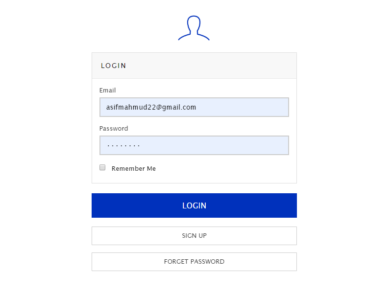
#### Alert
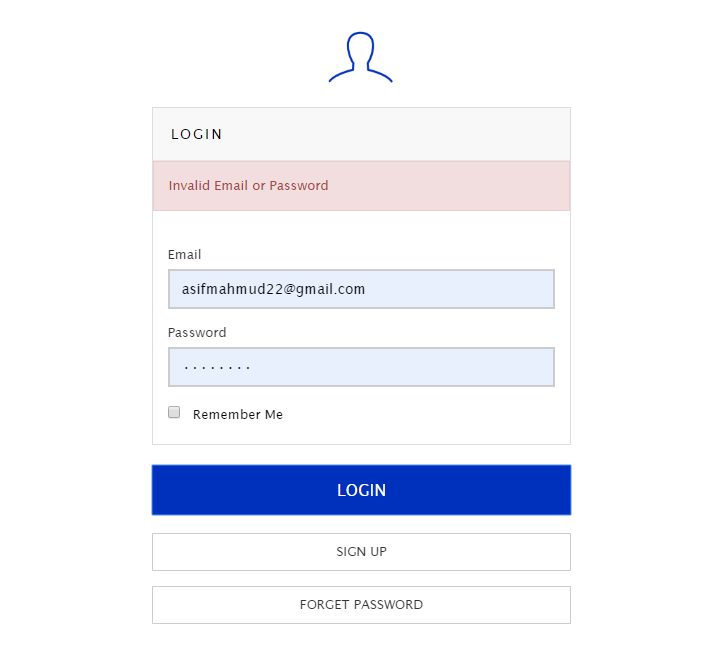

### Signup
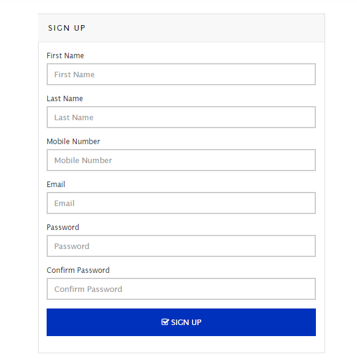
#### Alert
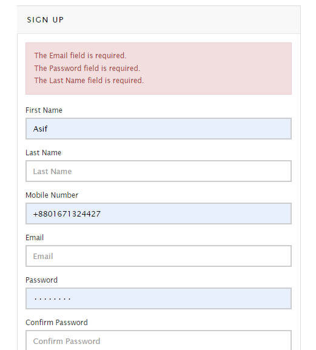

### Booking Tests
The UI elements those were tested in Hotel, Flight, Tour and Car booking tests are shown below:

#### Booking Fields
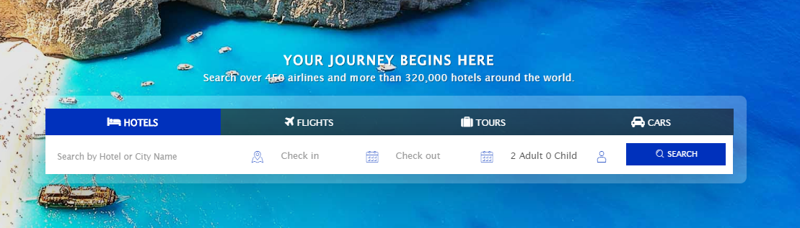
#### Calenders
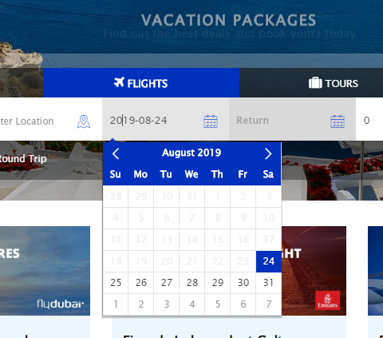
#### Dropdowns
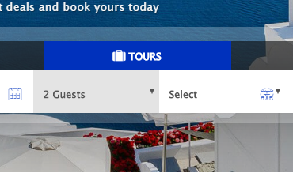
#### New Windows
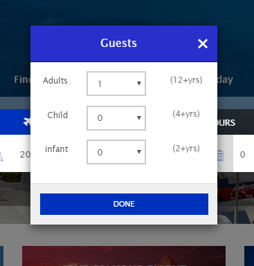
#### Radio Buttons
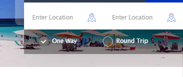
#### Inputs Fields
##### Booking Options Fields
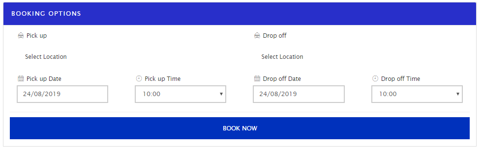
##### Booking Options Fields
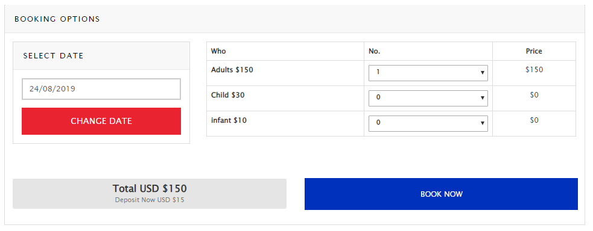
##### Information For Invoice Fields
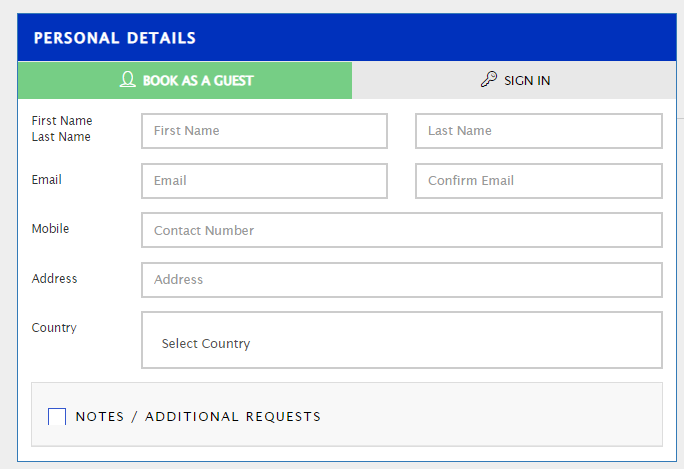
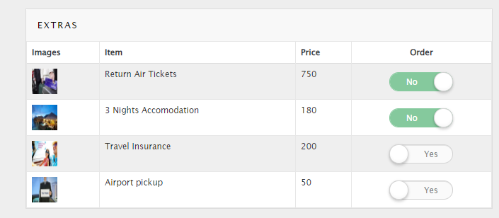
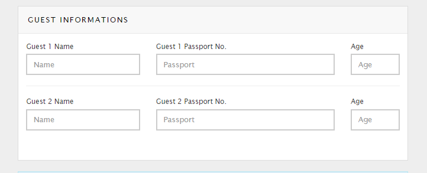
##### Tour Review Input Fields
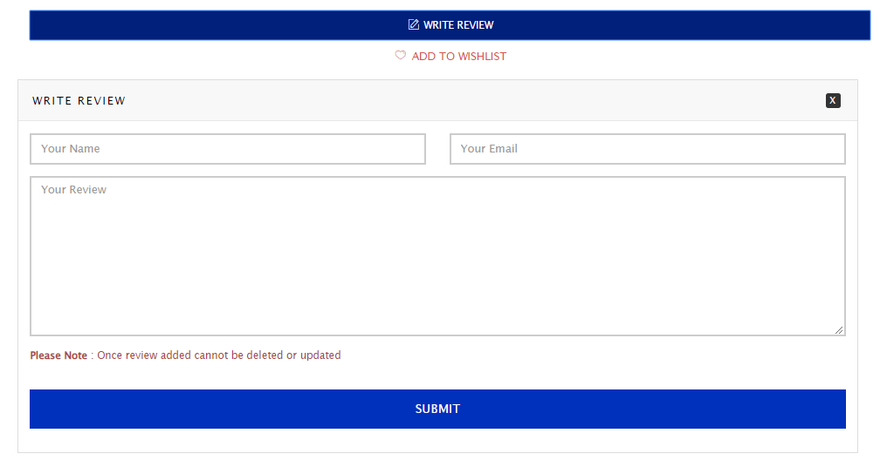
#### Booking Alerts
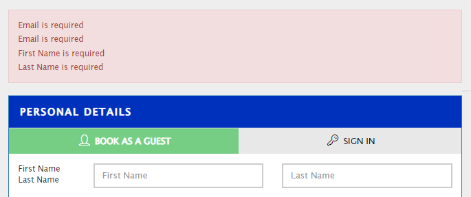
#### Invoice
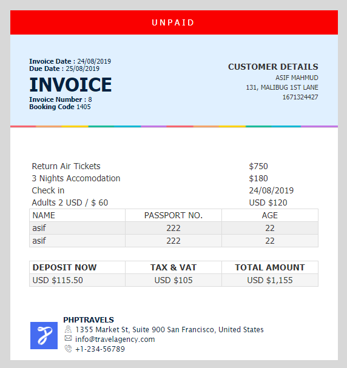
#### Payments
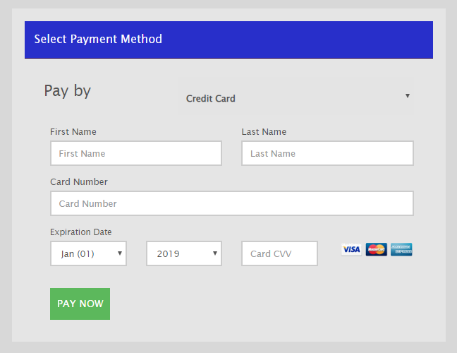
#### Featured Tour Book
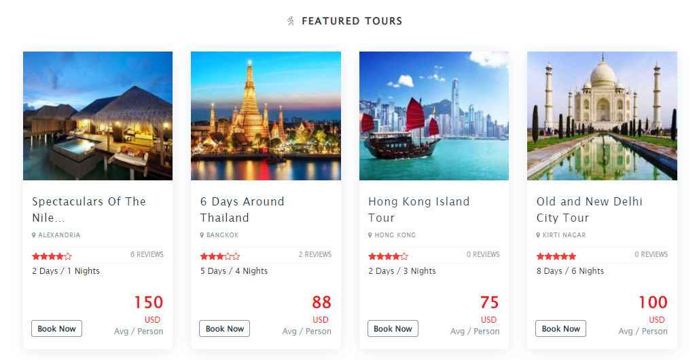
#### Featured Car Book
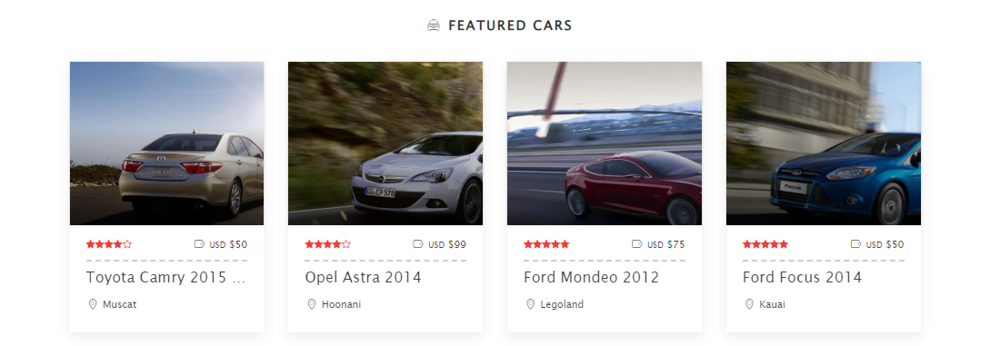

### Home Page Navigation
#### Blogs
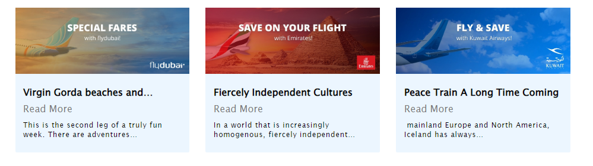
#### Sidebar
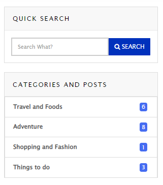
#### Offers
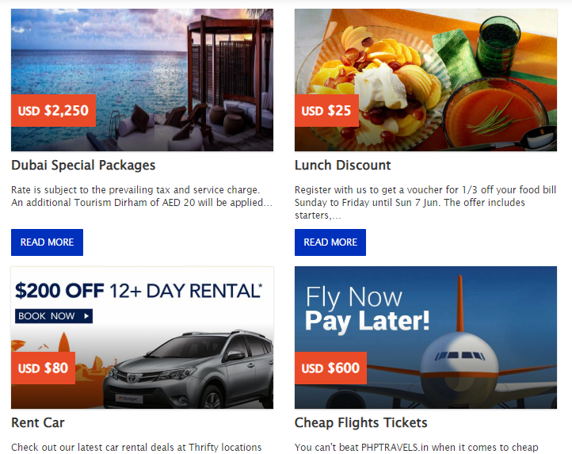

### Footer Links Test

#### Supplier Signup
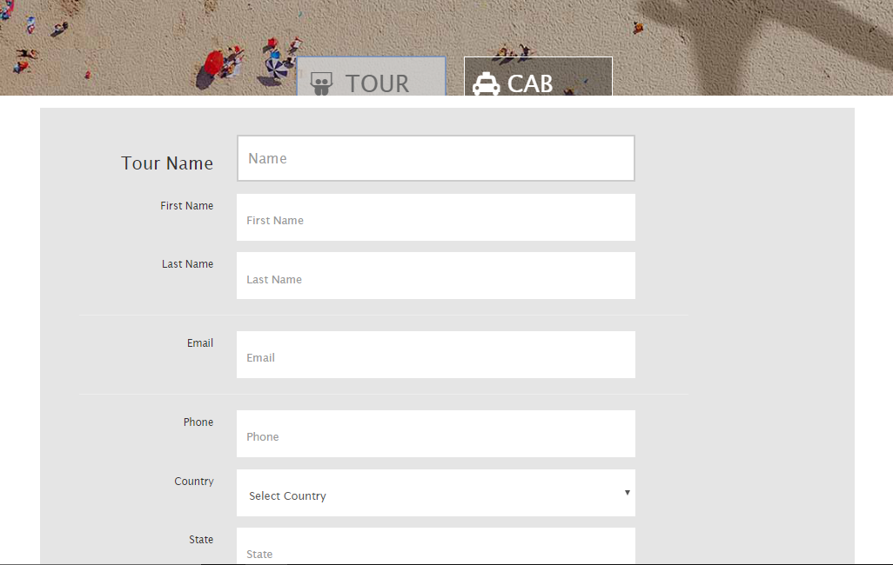

## Conclusion
The project 2 is completed after testing all the ui features of [PHPTRAVELS](https://www.phptravels.net/) successfully.

